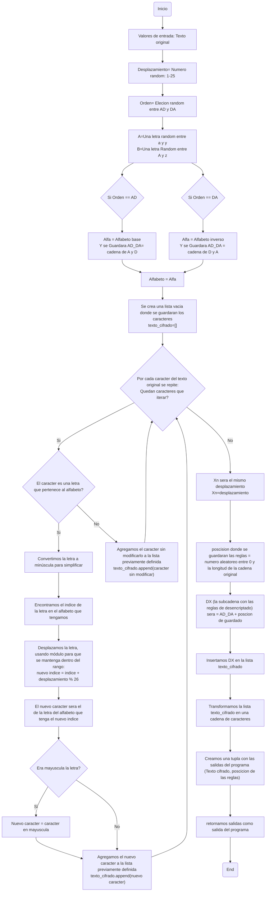
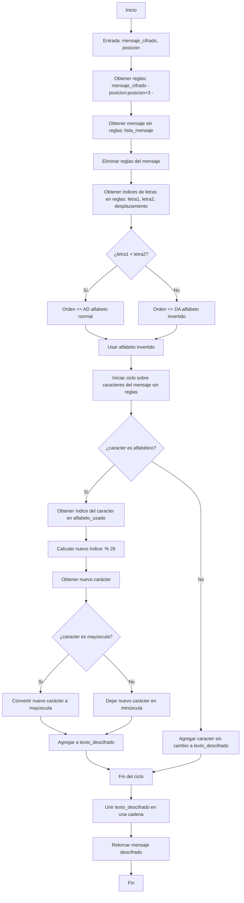
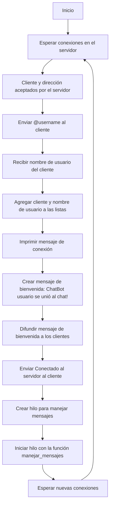

# Código de Schrodinger - Proyecto S.I.C.R.A
En este repositorio se encuentra la información sintetizada y el desarrollo funcional del proyecto final para la materia de Programación Básica.

## Índice
- [Introducción](#introducción)
   - [¿En qué consiste el proyecto S.I.C.R.A?](#en-qué-consiste-el-proyecto-sicra)
- [Servidor / Cliente](#servidor--cliente)
  - [Comunicación cliente / servidor.](#comunicación-cliente--servidor)
  - [Servidor](#servidor)
    - [Versión inicial Chat Cliente - Conexión servidor](#versión-inicial-chat-cliente---conexión-servidor)
  - [Cliente](#cliente)
    - [Versión inicial Chat Cliente - Conexión cliente](#versión-inicial-chat-cliente---conexión-cliente)
- [Cifrado ATEDv3](#cifrado-atedv3)
  - [¿En qué consiste el cifrado cesar?](#en-qué-consiste-el-cifrado-cesar)
  - [Sistema de cifrado implementado en el proyecto](#sistema-de-cifrado-implementado-en-el-proyecto)
     - [Sistema de reglas](#sistema-de-reglas)
     - [Sistema de encriptado](#sistema-de-encriptado)
     - [Sistema de desencriptado](#sistema-de-desencriptado)
- [Integración S.I.C.R.A](#integración-sicra)
  - [Servidor integrado](#servidor-integrado)
    - [Explicación de las funciones 1](#explicación-de-las-funciones-1)
  - [Usuario integrado](#usuario-integrado)
    - [Explicación de las funciones 2](#explicación-de-las-funciones-2)
- [Fuentes de consulta](#fuentes-de-consulta)
  
## Introducción
### ¿En qué consiste el proyecto S.I.C.R.A?
S.I.C.R.A es un sistema de cifrado personalizado basado en el cifrado César, diseñado de tal manera para proteger mensajes en un chat. Utiliza socket para conexiones "TCP" y "Threading" para la concurrencia, permitiendo el envío y recepción de mensajes en tiempo real. La seguridad se refuerza con un desplazamiento aleatorio y reglas de cifrado que permiten su descifrado en el servidor.

## Servidor / Cliente
### Comunicación cliente / servidor.
El sistema S.I.C.R.A se basa en una arquitectura de comunicación tipo "Socket" para la comunicación entre el cliente y el servidor usando el protocolo "TCP". El servidor actua como intermediario para que se realice la conexión de múltiples clientes y asegurando ue la transmisión de mensajes (cifrados y desifrados) se realice de manera efectiva.

### Servidor:
- Se ejecuta en un localhost (o en una IP de un servidor), el cual escucha las peticiones que se realizan en un puerto determinado.
- Emplea el uso de "Socket" para aceptar conexiones y "Threading" para gestionar de manera efectiva las peticiones que se realizan.
- Recibe los mensajes cifrados, los envía y a la vez los descodifica.

#### Versión inicial Chat Cliente - Conexión servidor.
```python
import socket   
import threading

# Alfabeto estándar en minúsculas
base_alfabeto = list("abcdefghijklmnopqrstuvwxyz")  

# Dirección y puerto del servidor
host = '127.0.0.1'  # Dirección local (localhost)
puerto = 55555  

# Creación del socket del servidor
servidor = socket.socket(socket.AF_INET, socket.SOCK_STREAM)

# Vinculación del servidor a la dirección y puerto
servidor.bind((host, puerto))
servidor.listen()

print(f"Servidor en ejecución en {host}:{puerto}")

# Listas para almacenar clientes conectados y sus nombres de usuario
clientes = []
usuarios = []

# Función para enviar mensajes a todos los clientes excepto al remitente
def transmitir(mensaje, _cliente):
    for cliente in clientes:
        if cliente != _cliente:
            cliente.send(mensaje)

# Función para manejar los mensajes entrantes de un cliente
def manejar_mensajes(cliente):
    while True:
        try:
            # Recibir mensaje del cliente
            mensaje = cliente.recv(1024)
            # Enviar el mensaje a los demás clientes
            transmitir(mensaje, cliente)
        except:
            # Si hay un error (cliente desconectado), eliminarlo de las listas
            indice = clientes.index(cliente)
            usuario = usuarios[indice]
            transmitir(f"Servidor: {usuario} se ha desconectado".encode('utf-8'), cliente)
            clientes.remove(cliente)
            usuarios.remove(usuario)
            cliente.close()
            break

# Función para aceptar y gestionar nuevas conexiones de clientes
def recibir_conexiones():
    while True:
        cliente, direccion = servidor.accept()

        # Solicitar nombre de usuario al cliente
        cliente.send("@username".encode("utf-8"))
        usuario = cliente.recv(1024).decode('utf-8')

        # Almacenar cliente y nombre de usuario
        clientes.append(cliente)
        usuarios.append(usuario)

        print(f"{usuario} se ha conectado desde {str(direccion)}")

        # Notificar a los demás clientes que un nuevo usuario se ha unido
        mensaje = f"Servidor: {usuario} se ha unido al chat!".encode("utf-8")
        transmitir(mensaje, cliente)
        cliente.send("Conectado al servidor".encode("utf-8"))

        # Iniciar un hilo para manejar los mensajes de este cliente
        hilo = threading.Thread(target=manejar_mensajes, args=(cliente,))
        hilo.start()

# Iniciar la función para aceptar conexiones
recibir_conexiones()

```

### Cliente
- Se conecta al servidor usando "TCP".
- Cifra los mensajes antes de enviar algún mensaje.
- Maneja la codificación "UTF-8" para la transmisión de información con el servidor.

#### Versión inicial Chat Cliente - Conexión cliente.
```python
import socket
import threading
import builtins

# Solicita el nombre de usuario mediante la función original input
usuario = builtins.input("Ingrese su nombre de usuario: ")

host = '127.0.0.1'
puerto = 55555

# Configuración del socket del cliente
cliente = socket.socket(socket.AF_INET, socket.SOCK_STREAM)
cliente.connect((host, puerto))

# Función para recibir mensajes enviados por el servidor
def recibir_mensajes():
    while True:
        try:
            mensaje = cliente.recv(1024).decode('utf-8')
            if mensaje == "@username":
                cliente.send(usuario.encode('utf-8'))
            else:
                # Imprime el mensaje recibido con saltos de línea para mayor legibilidad
                print("\n" + mensaje + "\n")
        except Exception as error:
            print("\nError:", error)
            cliente.close()
            break


# Función para enviar mensajes al servidor
def escribir_mensajes():
    while True:
        mensaje = f"{usuario}: {input('')}"
        cliente.send(mensaje.encode('utf-8'))

# Inicia los hilos para recibir y enviar mensajes
threading.Thread(target=recibir_mensajes).start()
threading.Thread(target=escribir_mensajes).start()
```

## Cifrado ATEDv3
### ¿En qué consiste el cifrado cesar?
El cifrado César consiste en un sistema del estilo sustitución, en el que cada letra del texto original es desplazado por otra letra que se encuentra a un número fijo de posición de la letra en el alfabeto. Ya sea un desplazamiento de 3 en la palabra "Hola", empezando por la "H" siendo reemplazada por la "K", la "o" por la letra "r", la "l" por la "o" y finalmente la "a" por la "d", dando como resultado "Krod".

### Sistema de cifrado implementado en el proyecto
El sistema creado para el proyecto fue, como se menciona anteriormente, inspirado en el cifrado César, pero con la implementacion de unas reglas que amplian sus posibilidades de combinacion, las cuales serian las siguientes:

#### Sistema de reglas:
- AD_DA: Orden del Alfabeto (se puede usar cualquier letra)
En terminos simples si el alfabeto se tomara como una lista, cada letra tendria un indice, si el indice de la primera es menor al de la segunda, es AD en caso contrario es DA

alpha_base = list("abcdefghijklmnopqrstuvwxyz") #26 indices de 0-25

- AD: orden normal, cualquier letra que en orden alfabetico este antes y otra despues (eo, fg, xy, etc) "a" tomaria indice 0 aqui ejem
- DA: orden inverso cualquier letra que en orden alfabetico este despues y otra anterior a esa misma (oe, gf, xy)  "a" tomaria indice 25 aqui ejem

- X#:
Desplazamiento basado en cifrado cesar, al guardarse como regla este numero se reemplaza por por una letra con el "indice" de desplazamiento: alpha_base[#desplazamiento]

- DX#
Sera AD_DA + X# y la posicion dentro del texto, escencialmente son las reglas y en donde se guardan, funcionara como un "insert", esta regla es escencial para facilitar el desencriptado.

#### Sistema de encriptado
```python
import random
alpha_base = list("abcdefghijklmnopqrstuvwxyz") #Alfabeto estandar
def cifrado_atedv2(texto):
  desplazamiento = random.randint(1,25) #el desplazamiento sera aleatorio
  orden=random.choice(["AD","DA"])#Aqui se definira el orden del alfabeto a usar
  #Valor aleatorio para AD_DA
  A=(random.randint(0, 23)) #Una letra random del alfabeto
  D=(random.randint(A+1, 25)) #Otra letra random de indice mayor que A
  if orden=="AD":
    alfa=alpha_base
    AD_DA=str(alpha_base[A]) + str(alpha_base[D])
  if orden=="DA":
    alfa=list("zyxwvutsrqponmlkjihgfedcba") #Alfabeto inverso en caso de "DA"
    AD_DA=str(alpha_base[D]) + str(alpha_base[A])
  alpha = alfa
  texto_cifrado = [] # Los caracteres se guardaran en una lista de 1 en 1
  for char in texto:  #Se repetira por la longitud de caracteres en el texto
    if char.isalpha():  #Identificar si es una letra del alfabeto
      char_minus = char.lower() # Convertimos la letra a minúscula para simplificar
      indice = alpha.index(char_minus)  #Encontramos el indice de la letra en el alfabeto
      # Desplazamos la letra, usando módulo para que se mantenga dentro del rango (A-Z)
      nuevo_indice = (indice + desplazamiento) % 26
      nuevo_char = alpha[nuevo_indice]
      if char.isupper(): # Si la letra original era mayúscula, la convertimos nuevamente a mayúscula
        nuevo_char = nuevo_char.upper()
      texto_cifrado.append(nuevo_char) #La letra nueva se agregara a la lista como caracter unico
    else:
      texto_cifrado.append(char) #Si no es una letra, lo agregamos tal cual (espacios, signos de puntuación, etc.)
  Xn=alpha_base[desplazamiento]
  pos=random.randint(0, len(list(texto_original))) #Posicion de DX
  DX =(AD_DA+Xn) #DX es el orden y desplazamiento cesar
  texto_cifrado.insert(pos, DX) #DX sera insertado en la lista en una "pos"icion random

  salida=''.join(texto_cifrado) #''join agregara los elementos de la lista "texto_cifrado" a una cadena vacia
  #transformandola efectivamente en una cadena
  print("\nReglas que se guardaron: ",DX,) #Verificador de salida
  #^^#Opcional para verificar que las salidas son correctas
  salidas=[salida, pos] # [0] es la cadena cifrada
  return salidas #salidas=[Texto cifrado, posicion de las reglas] (Guia de elementos)

if __name__=="__main__":
  texto_original = input("Texto a cifrar: ")
  #Mensajes de prueba:
  #Hola Buenos dias como estan gente aqui cifrando un mensaje con un viejo amigo, FELIZ LUNES
  #Hola buenas!, esto funciona?

  texto_cifrado = cifrado_atedv2(texto_original) #La salida sera totalmente aleatorea
  pos=texto_cifrado[1]

  print("\nTexto cifrado:", texto_cifrado[0])
  salida=texto_cifrado[0]
  #Opcional:
  print("\nEscencialmente no se imprimiran:")
  print("\nPosicion de reglas en la cadena:",pos)
  print("Reglas guardadas: ",str(salida[pos]+salida[pos+1]+salida[pos+2]),) #Esta salida debe ser igual a la de la funcion
  print("Orden: ", (salida[pos]+salida[pos+1]),"interpretarlo frente a lo dicho en el documento")
```
#### Diagrama de flujo de la funcion definida cifrado_atedv2


#### Sistema de desencriptado
```python
alpha_base = list("abcdefghijklmnopqrstuvwxyz") #Alfabeto estandar
def des_atedv2(salidad, pos):
  reglas=(salidad[pos],salidad[pos+1],salidad[pos+2]) #Se desarman las reglas guardadas, y se guardan en una tupla
  salida=list(salidad) #Tranformar la cadena cifrada en lista para facilitar 1 modificacion
  #Esta parte definira el orden de alfabeto usado:
  letra1 = alpha_base.index(reglas[0])
  letra2 = alpha_base.index(reglas[1])
  desplazamiento=alpha_base.index(reglas[2]) #La 3ra letra se transformara en un numero con esto
  #cada letra tiene un indice definido en el alpha_base veremos cual va primero para definir el orden
  if letra1<letra2:
    orden="AD"
  else: orden="DA"

  for p in range(3):#Esto eliminara DX de la cadena (aqui aplica el porque de la conversion)
    salida.pop(pos) #Quitara los caracteres de DX

  salida=''.join(salida) #lo convertimos a cadena de nuevo para reciclar la funcion

  #Consulta de orden y definicion de alfabeto:
  if orden=="AD":
    alfa=alpha_base
  if orden=="DA":
    alfa=list("zyxwvutsrqponmlkjihgfedcba") #Alfabeto inverso en caso de "DA"
  alpha = alfa #Alfabeto definido con el orden
  texto_descifrado = [] # Los caracteres se guardaran en una lista de 1 en 1
  for char in salida:  #Se repetira por la longitud de caracteres en el texto
    if char.isalpha():  #Identificar si es una letra del alfabeto
      char_minus = char.lower() # Convertimos la letra a minúscula para simplificar
      indice = alpha.index(char_minus)  #Encontramos el indice de la letra en el alfabeto
      # Desplazamos la letra, usando módulo para que se mantenga dentro del rango (A-Z)
      nuevo_indice = (indice - desplazamiento) % 26 #Esta vez restandole el desplazamiento
      nuevo_char = alpha[nuevo_indice] #La letra modificada
      if char.isupper(): # Si la letra original era mayúscula, la convertimos nuevamente a mayúscula
        nuevo_char = nuevo_char.upper()
      texto_descifrado.append(nuevo_char) #La letra nueva se agregara a la lista como caracter unico
    else:
      texto_descifrado.append(char) #Si no es una letra, lo agregamos tal cual (espacios, signos de puntuación, etc.)

  salida_f=''.join(texto_descifrado)

  return salida_f
  
if __name__=="__main__":
  #Entradas del programa=[salida, pos] (Guia de elementos)

  texto_cifrado = input("Texto a desencriptar: ") #Hola Mundo!
  pos=int(input("poscicion de DX: "))

  texto_desencriptado = des_atedv2(texto_cifrado, pos)

  print("\nTexto cifrado:", texto_cifrado)
  print("\nTexto desencriptado:", texto_desencriptado)
```
#### Diagrama de flujo de la funcion definida des_atedv2

``` mermaid
flowchart TD
    A("Inicio") --> n1["Valores de entrada: (texto cifrado, poscicion de las reglas [pos])"]
    n1 --> n2["Reglas se definira como una tupla que contenga las letras con los indices [pos, pos+1 y pos+2] (seran 3 letras)"]
    n2 --> n3["Convertimos el texto cifrado en una lista para una rapida modificacion"]
    n3 --> n4["Se tomaran las primeras 2 letras de reglas para compararlas"]
    n4 --> n5["Se transforma la 3ra letra en un numero tomando esa letra y viendo que indice tiene con respecto al alfabeto estandar"]
    n7["La primera letra tiene un valor menor que a la segunda?"] -- Si --> n8["Orden = AD"]
    n7 -- No --> n9["Orden = DA"]
    n8 --> n10["for i in range 3<br>i&lt;3"]
    n9 --> n10
    n10 -- si --> n11["Remover la letra con indice [pos]"]
    n10 -- No --> n12["Convetimos la lista en una cadena de caracteres"]
    n11 --> n10
    n12 --> n13["Consultamos el orden y definimos alfabeto"]
    n13 --> n14["Orden==AD ?"]
    n14 -- Si --> n15["Alfa = Alfabeto estandar"]
    n14 -- No --> n16["Alfa = Alfabeto inverso"]
    n15 --> n17["Alpha = Alfa"]
    n16 --> n17
    n17 --> n18["Creamos una lista donde se guardaran los nuevos caracteres: texto_descifrado[]"]
    n18 --> n19["Por cada caracter del texto cifrado se repite:<br>Quedan caracteres que iterar?"]
    n19 -- Si --> n20["El caracter es una letra que pertenece al alfabeto?"]
    n20 -- Si --> n21["Convertimos la letra a minuscula para simplificar"]
    n20 -- No --> n22["Agregamos el caracter sin modificarlo a la lista texto_descifrado.append[caracter]"]
    n22 --> n20
    n21 --> n23@{ label: "<div style=\"color:\"><span style=\"color:\">Encontramos el indice de la letra en el alfabeto</span></div>" }
    n23 --> n24@{ label: "<div style=\"color:\"><span style=\"color:\">Desplazamos la letra, usando módulo para que se mantenga dentro del rango (A-Z)<br><br></span><div style=\"color:\"><span style=\"color:\">nuevo_indice = </span><span style=\"color:\">(</span><span style=\"color:\">indice - desplazamiento</span><span style=\"color:\">)</span><span style=\"color:\"> % </span><span style=\"color:\">26 restando el desplazamiento</span></div></div>" }
    n24 --> n25["se define el nuevo caracter como la letra en el alfabeto que tenga el nuevo indice"]
    n25 --> n26["El caracter original estaba en mayuscula?"]
    n26 -- Si --> n27["Nuevo caracter = Caracter en mayuscula"]
    n27 --> n28["Agregamos el nuevo carater a la lista texto_descifrado"]
    n5 --> n7
    n26 -- no --> n28
    n19 -- No --> n29["Transformamos la lista con todos los caracteres en una cadena y la definimos como salida"]
    n29 --> n30["Retornamos salida"]
    n28 --> n19
    n30 --> n31["End"]

    n7@{ shape: diam}
    n10@{ shape: diam}
    n14@{ shape: diam}
    n19@{ shape: diam}
    n20@{ shape: diam}
    n23@{ shape: rect}
    n24@{ shape: rect}
    n26@{ shape: diam}
    n31@{ shape: rounded}
```


**Importante:** *Para mejor entendimiento de Salidas consulte el nootebook adjunto abajo*

Si quiere probar independientemente alguna de las 2 funciones y/o ver versiones tempranas del codigo entre a: https://github.com/Felip-UN/ATEDx1

## Integración S.I.C.R.A
### Servidor integrado.
```python
import socket
import threading

# Definición del alfabeto estándar (incluye vocales acentuadas)
alfabeto = list("abcdefghijklmnopqrstuvwxyzáéíóú")
host = '127.0.0.1'
puerto = 55555

# Configuración del socket del servidor
servidor = socket.socket(socket.AF_INET, socket.SOCK_STREAM)
servidor.bind((host, puerto))
servidor.listen()
print(f"Servidor ejecutándose en {host}:{puerto}")

# Listas para almacenar los clientes conectados y sus nombres de usuario
clientes = []
nombres_usuario = []

# Función para difundir (enviar) un mensaje a todos los clientes, excepto al remitente
def difundir(mensaje, cliente_excluido):
    for cliente in clientes:
        if cliente != cliente_excluido:
            cliente.send(mensaje)

# Función para descifrar un mensaje cifrado
def descifrar_mensaje(mensaje_cifrado, posicion):
    # Extrae las "reglas" (DX) que fueron insertadas en la posición 'posicion' (3 caracteres)
    reglas = mensaje_cifrado[posicion:posicion+3]
    # Convierte la cadena en lista para facilitar la eliminación de los caracteres de reglas
    lista_mensaje = list(mensaje_cifrado)
    for _ in range(3):
        lista_mensaje.pop(posicion)
    # Reconstruye la cadena sin las reglas insertadas
    mensaje_sin_reglas = ''.join(lista_mensaje)
    
    # Se extraen los dos primeros caracteres y el tercero (que indica el desplazamiento)
    letra1 = alfabeto.index(reglas[0])
    letra2 = alfabeto.index(reglas[1])
    desplazamiento = alfabeto.index(reglas[2])
    
    # Determina el orden del alfabeto usado:
    # Si el índice del primer carácter es menor, se asume orden normal ("AD");
    # de lo contrario, se usará el alfabeto invertido.
    if letra1 < letra2:
        orden = "AD"
    else:
        orden = "DA"
    
    # Selecciona el alfabeto a usar según el orden
    alfabeto_usado = alfabeto if orden == "AD" else list("zyxwvutsrqponmlkjihgfedcbaúóíéá")
    
    # Descifra el mensaje restando el desplazamiento a cada letra
    texto_descifrado = []
    for caracter in mensaje_sin_reglas:
        if caracter.isalpha():
            caracter_minus = caracter.lower()
            indice = alfabeto_usado.index(caracter_minus)
            nuevo_indice = (indice - desplazamiento) % 26
            nuevo_caracter = alfabeto_usado[nuevo_indice]
            if caracter.isupper():
                nuevo_caracter = nuevo_caracter.upper()
            texto_descifrado.append(nuevo_caracter)
        else:
            texto_descifrado.append(caracter)
    
    return ''.join(texto_descifrado)

# Función para manejar los mensajes recibidos de un cliente
def manejar_mensajes(cliente):
    while True:
        try:
            mensaje = cliente.recv(1024).decode('utf-8')
            # Se espera que el mensaje tenga el formato:
            # "usuario: <texto_cifrado>||<posicion>"
            if "||" in mensaje:
                try:
                    usuario, resto = mensaje.split(":", 1)
                    texto_cifrado, pos_str = resto.split("||", 1)
                    posicion = int(pos_str.strip())
                    # Se prepara la versión codificada (sin mostrar el delimitador ni la posición)
                    mensaje_codificado = f"{usuario}:{texto_cifrado.strip()}"
                    # Se descifra el mensaje usando la función definida
                    mensaje_descifrado = descifrar_mensaje(texto_cifrado.strip(), posicion)
                    mensaje_completo = (f"{mensaje_codificado}\n"
                                        f"Mensaje Descifrado: {usuario}:{mensaje_descifrado}")
                    print("\n" + mensaje_completo + "\n")
                    # Difunde el mensaje completo a los demás clientes
                    difundir(mensaje_completo.encode('utf-8'), cliente)
                except Exception as error:
                    print("\nError durante el descifrado:", error, "\n")
                    difundir(mensaje.encode('utf-8'), cliente)
            else:
                print("\nMensaje recibido:", mensaje, "\n")
                difundir(mensaje.encode('utf-8'), cliente)
        except Exception as error:
            indice = clientes.index(cliente)
            usuario = nombres_usuario[indice]
            difundir(f"ChatBot: {usuario} desconectado".encode('utf-8'), cliente)
            clientes.remove(cliente)
            nombres_usuario.remove(usuario)
            cliente.close()
            break

# Función para recibir nuevas conexiones de clientes
def recibir_conexiones():
    while True:
        cliente, direccion = servidor.accept()
        cliente.send("@username".encode("utf-8"))
        usuario = cliente.recv(1024).decode('utf-8')
        clientes.append(cliente)
        nombres_usuario.append(usuario)
        print(f"{usuario} se ha conectado desde {direccion}")
        mensaje_bienvenida = f"ChatBot: {usuario} se unió al chat!".encode("utf-8")
        difundir(mensaje_bienvenida, cliente)
        cliente.send("Conectado al servidor".encode("utf-8"))
        hilo = threading.Thread(target=manejar_mensajes, args=(cliente,))
        hilo.start()

# Inicia la recepción de conexiones
recibir_conexiones()
```
#### Explicación de las funciones 1
1. difundir(mensaje, cliente_excluido):
Enviar el mensaje a todos los clientes, menos a quien lo ha enviado.

```python
def difundir(mensaje, cliente_excluido):
    for cliente in clientes:
        if cliente != cliente_excluido:
            cliente.send(mensaje)
   ```
 ``` mermaid
flowchart TD
    A[Inicio] --> B[Entrada: mensaje, cliente_excluido]
    B --> C[Iniciar ciclo sobre clientes]
    C --> D{¿cliente != cliente_excluido?}
    D -->|Sí| E[Enviar mensaje]
    D -->|No| F[Saltar al siguiente cliente]
    E --> F
    H -->|Sí| G[Fin del ciclo]
    F --> H{¿Se recorrieron todos los clientes?}
    H --> |No| D
 ```  

2.  def descifrar_mensaje(mensaje_cifrado, posicion):
Recibe un mensaje cifrado el cual viene con una subcadena con las reglas de cifrado, extrae dichas reglas y elimina la subcadena (regla) y descifra el mensaje restando el desplazamiento indicado.

```python
def descifrar_mensaje(mensaje_cifrado, posicion):
    reglas = mensaje_cifrado[posicion:posicion+3]
    lista_mensaje = list(mensaje_cifrado)
    for _ in range(3):
        lista_mensaje.pop(posicion)
    mensaje_sin_reglas = ''.join(lista_mensaje)
    
    letra1 = alfabeto.index(reglas[0])
    letra2 = alfabeto.index(reglas[1])
    desplazamiento = alfabeto.index(reglas[2])
    
    if letra1 < letra2:
        orden = "AD"
    else:
        orden = "DA"
    
    alfabeto_usado = alfabeto if orden == "AD" else list("zyxwvutsrqponmlkjihgfedcbaúóíéá")
    
    texto_descifrado = []
    for caracter in mensaje_sin_reglas:
        if caracter.isalpha():
            caracter_minus = caracter.lower()
            indice = alfabeto_usado.index(caracter_minus)
            nuevo_indice = (indice - desplazamiento) % 26
            nuevo_caracter = alfabeto_usado[nuevo_indice]
            if caracter.isupper():
                nuevo_caracter = nuevo_caracter.upper()
            texto_descifrado.append(nuevo_caracter)
        else:
            texto_descifrado.append(caracter)
    
    return ''.join(texto_descifrado)
```


3. def manejar_mensajes(cliente):
Administra mensajes que provienen de un cliente.

```python
def manejar_mensajes(cliente):
    while True:
        try:
            mensaje = cliente.recv(1024).decode('utf-8')
            if "||" in mensaje:
                try:
                    usuario, resto = mensaje.split(":", 1)
                    texto_cifrado, pos_str = resto.split("||", 1)
                    posicion = int(pos_str.strip())
                    mensaje_codificado = f"{usuario}:{texto_cifrado.strip()}"
                    mensaje_descifrado = descifrar_mensaje(texto_cifrado.strip(), posicion)
                    mensaje_completo = (f"{mensaje_codificado}\n"
                                        f"Mensaje Descifrado: {usuario}:{mensaje_descifrado}")
                    print("\n" + mensaje_completo + "\n")
                    difundir(mensaje_completo.encode('utf-8'), cliente)
                except Exception as error:
                    print("\nError durante el descifrado:", error, "\n")
                    difundir(mensaje.encode('utf-8'), cliente)
            else:
                print("\nMensaje recibido:", mensaje, "\n")
                difundir(mensaje.encode('utf-8'), cliente)
        except Exception as error:
            indice = clientes.index(cliente)
            usuario = nombres_usuario[indice]
            difundir(f"ChatBot: {usuario} desconectado".encode('utf-8'), cliente)
            clientes.remove(cliente)
            nombres_usuario.remove(usuario)
            cliente.close()
            break
```
``` mermaid
flowchart TD
    A[Inicio] --> B[Recibir mensaje del cliente]
    B --> C{¿El mensaje contiene dos barras verticales?}
    
    %% Flujo para mensaje con "||"
    C -->|Sí| D[Separar mensaje en usuario y resto]
    D --> E[Separar texto cifrado y posición]
    E --> F[Convertir posición en número entero]
    F --> G[Descifrar mensaje con la función descifrar_mensaje]
    G --> H[Formatear mensaje: usuario y mensaje cifrado]
    H --> I[Imprimir mensaje completo]
    I --> J[Difundir mensaje completo a los clientes]
    J --> M[Continuar recibiendo mensajes]
    
    %% Flujo para mensaje sin "||"
    C -->|No| K[Imprimir mensaje recibido]
    K --> L[Difundir mensaje a los clientes]
    L --> M

    %% Manejo de errores durante el descifrado
    D1[Error al procesar mensaje cifrado] --> D2[Imprimir error]
    D2 --> D3[Difundir mensaje original a los clientes]
    D3 --> M

    %% Recibir mensaje de error (desconexión del cliente)
    B --> N{¿Error al recibir mensaje?}
    N -->|Sí| O[Obtener nombre de usuario y desconectar]
    O --> P[Difundir mensaje de desconexión]
    P --> Q[Cerrar conexión del cliente]
    Q --> R[Eliminar cliente y nombre de usuario de las listas]
    R --> S[Finalizar ciclo de cliente]
    N -->|No| B

    %% Función "descifrar_mensaje"
    subgraph Descifrar Mensaje
        A1[Inicio] --> A2[Obtener reglas del mensaje: texto_cifrado y posicion]
        A2 --> A3[Eliminar las reglas del mensaje]
        A3 --> A4[Obtener los índices de las reglas: letra1, letra2, desplazamiento]
        A4 --> A5{¿letra1 < letra2?}
        A5 -->|Sí| A6[Orden = AD alfabeto normal]
        A5 -->|No| A7[Orden = DA alfabeto invertido]
        A6 --> A8[Usar alfabeto normal]
        A7 --> A8
        A8 --> A9[Iterar sobre caracteres del mensaje sin reglas]
        A9 --> A10{¿caracter es alfabético?}
        A10 -->|Sí| A11[Obtener índice en alfabeto_usado]
        A11 --> A12[Calcular nuevo índice: <indice - desplazamiento> % 26]
        A12 --> A13[Obtener nuevo carácter con el nuevo índice]
        A13 --> A14{¿caracter es mayúscula?}
        A14 -->|Sí| A15[Convertir a mayúscula]
        A14 -->|No| A16[Dejar como minúscula]
        A15 --> A17[Agregar a texto_descifrado]
        A16 --> A17
        A10 -->|No| A18[Agregar caracter sin cambio a texto_descifrado]
        A17 --> A19[Unir texto_descifrado]
        A18 --> A19
        A19 --> A20[Retornar mensaje descifrado]
```

4. def recibir_conexiones()
Establece y acepta nuevas conexiones de clientes al servidor.

```python
def recibir_conexiones():
    while True:
        cliente, direccion = servidor.accept()
        cliente.send("@username".encode("utf-8"))
        usuario = cliente.recv(1024).decode('utf-8')
        clientes.append(cliente)
        nombres_usuario.append(usuario)
        print(f"{usuario} se ha conectado desde {direccion}")
        mensaje_bienvenida = f"ChatBot: {usuario} se unió al chat!".encode("utf-8")
        difundir(mensaje_bienvenida, cliente)
        cliente.send("Conectado al servidor".encode("utf-8"))
        hilo = threading.Thread(target=manejar_mensajes, args=(cliente,))
        hilo.start()
```

### Usuario integrado
```python
import socket
import threading
import random
import builtins

# Definición del alfabeto (incluye vocales acentuadas)
alfabeto = list("abcdefghijklmnopqrstuvwxyzáéíóú")

# Solicita el nombre de usuario mediante la función original input
usuario = builtins.input("Ingrese su nombre de usuario: ")

host = '127.0.0.1'
puerto = 55555

# Configuración del socket del cliente
cliente = socket.socket(socket.AF_INET, socket.SOCK_STREAM)
cliente.connect((host, puerto))

# Función para recibir mensajes enviados por el servidor
def recibir_mensajes():
    while True:
        try:
            mensaje = cliente.recv(1024).decode('utf-8')
            if mensaje == "@username":
                cliente.send(usuario.encode('utf-8'))
            else:
                # Imprime el mensaje recibido con saltos de línea para mayor legibilidad
                print("\n" + mensaje + "\n")
        except Exception as error:
            print("\nError:", error)
            cliente.close()
            break

# Función para cifrar un mensaje
def encriptar(mensaje):
    # Genera un desplazamiento aleatorio entre 1 y 25
    desplazamiento = random.randint(1, 25)
    # Selecciona aleatoriamente el orden del alfabeto ("AD" para orden normal, "DA" para invertido)
    orden = random.choice(["AD", "DA"])
    A = random.randint(0, 23)
    D = random.randint(A + 1, 25)
    if orden == "AD":
        alfabeto_usado = alfabeto
        reglas = str(alfabeto[A]) + str(alfabeto[D])
    else:
        alfabeto_usado = list("zyxwvutsrqponmlkjihgfedcba")
        reglas = str(alfabeto[D]) + str(alfabeto[A])
    
    texto_cifrado = []
    # Recorre cada carácter del mensaje para cifrarlo
    for caracter in mensaje:
        if caracter.isalpha():
            caracter_minus = caracter.lower()
            indice = alfabeto_usado.index(caracter_minus)
            nuevo_indice = (indice + desplazamiento) % 26
            nuevo_caracter = alfabeto_usado[nuevo_indice]
            # Si el carácter original era mayúscula, se vuelve mayúscula
            if caracter.isupper():
                nuevo_caracter = nuevo_caracter.upper()
            texto_cifrado.append(nuevo_caracter)
        else:
            texto_cifrado.append(caracter)
    # Se obtiene un carácter del alfabeto correspondiente al desplazamiento
    Xn = alfabeto[desplazamiento]
    # Se elige aleatoriamente una posición para insertar las reglas de cifrado
    posicion = random.randint(0, len(mensaje))
    DX = reglas + Xn  # Las reglas de cifrado (información interna)
    texto_cifrado.insert(posicion, DX)
    salida = ''.join(texto_cifrado)
    # Retorna el mensaje cifrado y la posición de inserción de las reglas, separados internamente por "||"
    return [salida, posicion]

# Se guarda la función original input y se redefine para enviar mensajes cifrados
entrada_original = builtins.input
def nueva_entrada(prompt=""):
    texto = entrada_original(prompt)
    if texto.strip():
        resultado_cifrado = encriptar(texto)
        return f"{resultado_cifrado[0]}||{resultado_cifrado[1]}"
    else:
        return texto

builtins.input = nueva_entrada

# Función para enviar mensajes al servidor
def escribir_mensajes():
    while True:
        # La función input ya retorna el mensaje cifrado con "||" y la posición
        mensaje = f"{usuario}: {input('')}"
        cliente.send(mensaje.encode('utf-8'))

# Inicia los hilos para recibir y enviar mensajes
threading.Thread(target=recibir_mensajes).start()
threading.Thread(target=escribir_mensajes).start()
```
```mermaid
flowchart TD
    A[Inicio] --> B[Definir alfabeto y solicitar nombre de usuario]
    B --> C[Conectar cliente al servidor host, puerto]
    
    %% Flujo para recibir mensajes
    C --> D[Iniciar hilo para recibir mensajes]
    D --> E[Esperar mensaje del servidor]
    E --> F{¿Mensaje es @username?}
    F -->|Sí| G[Enviar nombre de usuario al servidor]
    F -->|No| H[Imprimir mensaje recibido con salto de línea]
    G --> E
    H --> E

    %% Flujo para cifrar y enviar mensajes
    C --> I[Iniciar hilo para escribir mensajes]
    I --> J[Esperar entrada del usuario]
    J --> K{¿El mensaje no está vacío?}
    K -->|Sí| L[Cifrar el mensaje con encriptar]
    L --> M[Generar texto cifrado y posición]
    M --> N[Enviar mensaje cifrado al servidor]
    N --> I
    K -->|No| I

    %% Función de encriptación
    subgraph Encriptar
        A1[Generar desplazamiento aleatorio 1-25]
        A2[Seleccionar orden alfabético aleatorio AD o DA]
        A3[Seleccionar reglas de cifrado A, D según el orden]
        A4[Iterar sobre caracteres del mensaje]
        A5{¿Caracter es alfabético?}
        A5 -->|Sí| A6[Obtener índice del alfabeto y calcular nuevo índice]
        A6 --> A7[Obtener el nuevo carácter mayúscula/minúscula]
        A7 --> A8[Agregar al mensaje cifrado]
        A5 -->|No| A8
        A8 --> A9[Insertar las reglas y Xn en una posición aleatoria]
        A9 --> A10[Retornar mensaje cifrado y posición]

    %% Conexiones finales
    N --> O[Finalizar ciclo de envío de mensajes]
    O --> I
end
#### Explicación de las funciones 2
1. def recibir_mensajes()
Escucha los mensajes enviados desde el servidor y los procesa.

```python
def recibir_mensajes():
    while True:
        try:
            mensaje = cliente.recv(1024).decode('utf-8')
            if mensaje == "@username":
                cliente.send(usuario.encode('utf-8'))
            else:
                print("\n" + mensaje + "\n")
        except Exception as error:
            print("\nError:", error)
            cliente.close()
            break
```

2. def encriptar(mensaje)
Cifra el mensaje desplazando aleatoriamente en el alfabeto y agrega una subcadena con las reglas de cifrado de la posición.

```python
def encriptar(mensaje):
    desplazamiento = random.randint(1, 25)
    orden = random.choice(["AD", "DA"])
    A = random.randint(0, 23)
    D = random.randint(A + 1, 25)
    if orden == "AD":
        alfabeto_usado = alfabeto
        reglas = str(alfabeto[A]) + str(alfabeto[D])
    else:
        alfabeto_usado = list("zyxwvutsrqponmlkjihgfedcba")
        reglas = str(alfabeto[D]) + str(alfabeto[A])
    
    texto_cifrado = []
    for caracter in mensaje:
        if caracter.isalpha():
            caracter_minus = caracter.lower()
            indice = alfabeto_usado.index(caracter_minus)
            nuevo_indice = (indice + desplazamiento) % 26
            nuevo_caracter = alfabeto_usado[nuevo_indice]
            if caracter.isupper():
                nuevo_caracter = nuevo_caracter.upper()
            texto_cifrado.append(nuevo_caracter)
        else:
            texto_cifrado.append(caracter)
    
    Xn = alfabeto[desplazamiento]
    posicion = random.randint(0, len(mensaje))
    DX = reglas + Xn
    texto_cifrado.insert(posicion, DX)
    salida = ''.join(texto_cifrado)
    return [salida, posicion]
```

3. entrada_original = builtins.input
Modifica el ingreso del mensaje, para que se cifre antes de ser enviado al servidor.

```python
entrada_original = builtins.input
def nueva_entrada(prompt=""):
    texto = entrada_original(prompt)
    if texto.strip():
        resultado_cifrado = encriptar(texto)
        return f"{resultado_cifrado[0]}||{resultado_cifrado[1]}"
    else:
        return texto

builtins.input = nueva_entrada
```

4. def escribir_mensajes()
Captura la entrada del usuario (cifrada) y lo envía al servidor.

```python
def escribir_mensajes():
    while True:
        mensaje = f"{usuario}: {input('')}"
        cliente.send(mensaje.encode('utf-8'))
```

## Fuentes de consulta
Como extra se agrega que una de las principales fuentes de consulta fue [stock overflow](https://stackoverflow.com) en especial para lo que fue la biblioteca socket, [w3](https://www.w3schools.com) para la biblioteca **random** y ademas del repositorio de la clase 13 para guiarnos con algunas funciones [Github](https://github.com/fegonzalez7/pdc_unal_clase13)
